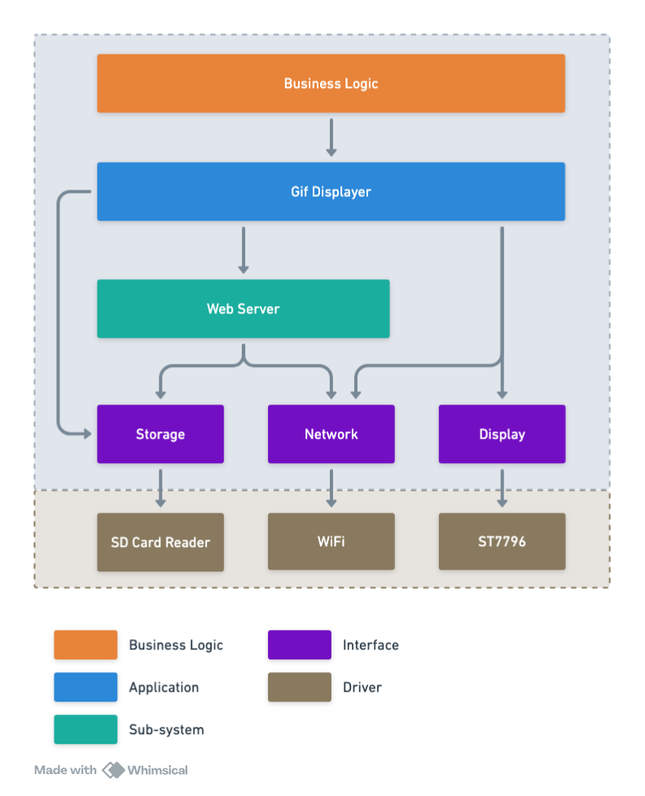

## Firmware Architecture



## Firmware Design

```C++

// Application
bool init();
bool displayGif(char *path);
bool displayAllGif(char *dir);
bool startWebServer();

// Display
bool init();
bool drawGif();

// Network
bool init();
bool connect(const char *ssid, const char *password);
bool disconnect();
bool isConnected();
bool getLocalIP();
bool getMACAddress();
bool getSignalStrength();

// Storage
bool init();
bool open();
bool deleteFile(char *path);
bool deleteAllFile(char *path);
bool isDirectory();

```